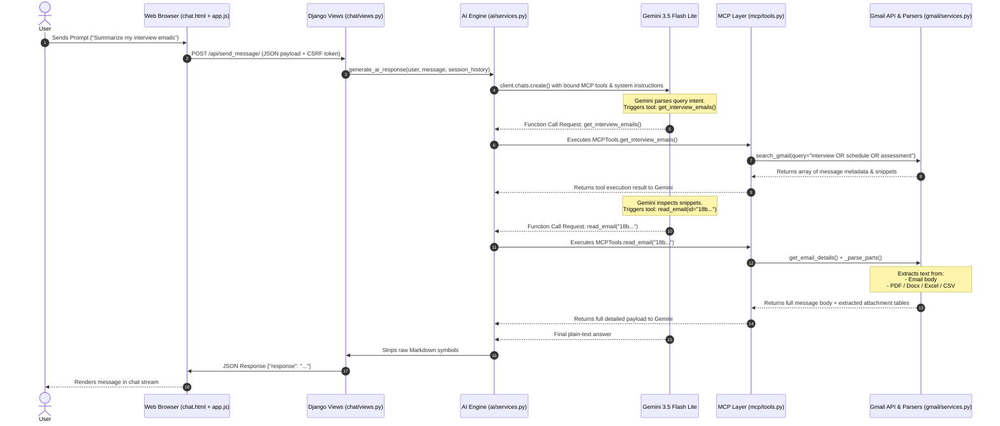

# 📧 Smart Mail Analyzer — AI Executive Assistant

Smart Mail Analyzer is an AI-powered Django web application that acts as an intelligent executive email assistant. Directly integrating with the **Gmail API** and powered by **Google Gemini AI** via **Model Context Protocol (MCP)** tools, it enables users to search, summarize, analyze, and query their email inbox and document attachments using natural language.

---

## 📋 Table of Contents

1. [Project Overview & Key Features](#-project-overview--key-features)
2. [Technical Stack](#-technical-stack)
3. [Architecture & End-to-End Data Flow](#-architecture--end-to-end-data-flow)
4. [File-by-File Project Structure](#-file-by-file-project-structure)
5. [Authentication & Security (Google OAuth 2.0 PKCE)](#-authentication--security-google-oauth-2-0-pkce)
6. [Gmail Engine & Attachment Text Extraction](#-gmail-engine--attachment-text-extraction)
7. [Model Context Protocol (MCP) Infrastructure](#-model-context-protocol-mcp-infrastructure)
8. [AI Agent & Google Gemini Integration](#-ai-agent--google-gemini-integration)
9. [Dual-Mode Operations (Inbox vs Document Analysis)](#-dual-mode-operations)
10. [Frontend Architecture & Design System](#-frontend-architecture--design-system)
11. [Installation & Local Setup](#-installation--local-setup)

---

## 🌟 Project Overview & Key Features

* **Natural Language Inbox Querying**: Ask questions like *"Did I receive any interview emails?"* or *"Summarize recent messages from HR"* without memorizing search syntax.
* **Strictly Read-Only Security**: Interacts with Gmail via `gmail.readonly` scopes, ensuring zero write, delete, or unintended email sending operations.
* **Multi-Format Attachment Parsing**: Deeply inspects email attachments, automatically extracting text/tables from **PDF** (`.pdf`), **Word** (`.docx`, `.doc`), **Excel** (`.xlsx`, `.xls`), and **CSV** (`.csv`) files.
* **Model Context Protocol (MCP) Tool Integration**: Exposes 20+ specialized read-only functions to Gemini AI, allowing real-time function calling for message retrieval, counting, sender searching, and attachment filtering.
* **Dual-Mode System**:
  - **Gmail Inbox Mode**: Queries real-time Gmail inbox messages and attached files.
  - **Document Analysis Mode**: Analyzes user-uploaded files (`.pdf`, `.docx`, `.xlsx`, `.csv`, `.txt`) using document-level MCP tools.
* **Modern SPA Interface**: Built with Glassmorphism UI, HSL color tokens, instant Light/Dark mode toggling (with zero-flicker head script), typing indicators, and a responsive layout.

---

## 🛠 Technical Stack

* **Backend Framework**: Python 3.10+, Django 6.0 (MVT Architecture)
* **AI Model & SDK**: `google-genai` SDK (`gemini-3.5-flash-lite` model with `AutomaticFunctionCalling`)
* **Tool Specification**: Custom Model Context Protocol (MCP) tool wrappers
* **External APIs**: Google Gmail API v1, Google OAuth 2.0 (with PKCE)
* **File Parsers**: `PyPDF2` (PDFs), `python-docx` (Word), `pandas` & `openpyxl` (Excel & CSV)
* **Database**: SQLite (persisting custom user models & OAuth tokens)
* **Frontend**: HTML5, CSS3 (Vanilla CSS variables), JavaScript (ES6 AJAX), FontAwesome 6, Google Fonts (`Outfit`, `Plus Jakarta Sans`)

---

## 🔄 Architecture & End-to-End Data Flow



---

## 📂 File-by-File Project Structure

```
Smart EA/
├── manage.py                # Django CLI entry point
├── requirements.txt         # Project Python dependencies
├── .env                     # API keys & OAuth secrets
├── PROJECT_PITCH.md         # Initial project pitch & feature roadmap
├── config/                  # Django project root configuration
│   ├── settings.py          # Main settings (Custom User, installed apps, secrets)
│   ├── urls.py              # Root URL routing table
│   ├── asgi.py              # ASGI server configuration
│   └── wsgi.py              # WSGI production server configuration
├── accounts/                # Authentication & User Management
│   ├── models.py            # Custom User model storing OAuth tokens
│   ├── views.py             # Google OAuth 2.0 PKCE login, callback & logout
│   └── urls.py              # Authentication routes (/accounts/login, /accounts/google, etc.)
├── gmail/                   # Gmail API Data Engine
│   ├── services.py          # API fetching & MIME attachment text extraction (PDF/Docx/Excel)
│   ├── views.py             # Inbox view handlers
│   └── urls.py              # Gmail routes (/gmail/dashboard/, /gmail/emails/)
├── mcp/                     # Model Context Protocol Tools Layer
│   ├── tools.py             # MCPTools class defining 20+ Gmail search & read tools
│   ├── gmail_service.py     # GmailClient credentials & token auto-refresh manager
│   └── document_tools.py    # DocumentMCPTools for local uploaded file queries
├── ai/                      # AI Engine & Gemini Integration
│   └── services.py          # Gemini client setup, function calling loop, system prompts
├── chat/                    # Chat Web Application
│   ├── views.py             # SPA views (/api/send_message/, /api/upload_document/, /api/clear_chat/)
│   └── urls.py              # Chat endpoints
├── templates/               # HTML Templates
│   ├── base.html            # Master layout, header, anti-flicker theme script, footer
│   ├── accounts/
│   │   └── login.html       # Google OAuth login landing page
│   └── chat/
│       └── chat.html        # SPA Chat interface, input form, New Chat button
└── static/                  # Static Web Assets
    ├── css/
    │   └── style.css        # HSL Glassmorphism design system & Light/Dark mode CSS
    └── js/
        └── app.js           # AJAX handlers, theme toggle, typing indicator, document upload
```

---

## 🔐 Authentication & Security (Google OAuth 2.0 PKCE)

1. **Custom User Model** (`accounts/models.py`): Extends `AbstractUser` to store:
   - `google_access_token`
   - `google_refresh_token`
   - `google_token_expiry`
2. **PKCE Verification Flow** (`accounts/views.py`):
   - Generates an authorization flow requesting `gmail.readonly`, `userinfo.email`, `userinfo.profile`, `openid`.
   - Saves the PKCE `code_verifier` in the session during `google_login()`.
   - Exchanges auth code for access & refresh tokens in `google_callback()`.
3. **Auto Token Refresh** (`mcp/gmail_service.py`):
   - When an access token expires, `Credentials.refresh(Request())` automatically refreshes the token using `google_refresh_token` and updates the user record in SQLite.

---

## 📄 Gmail Engine & Attachment Text Extraction

The `gmail/services.py` engine provides MIME parsing inside `_parse_parts()`:

* **PDF Files (`.pdf`)**: Downloaded via Gmail API attachments endpoint, decoded from base64, and parsed using `PyPDF2.PdfReader`.
* **Word Documents (`.docx`, `.doc`)**: Converted using `python-docx.Document`, extracting paragraph text lines.
* **Excel & CSV Spreadsheets (`.xlsx`, `.xls`, `.csv`)**: Binary streams read via `pandas.read_excel()` and `pandas.read_csv()`, converting cell matrices into readable text tables (`df.to_string()`).
* Extracted attachment text is automatically appended to the message body returned to Gemini AI under `--- Attachment: <filename> ---`.

---

## 🤖 Model Context Protocol (MCP) Infrastructure

The project uses a Model Context Protocol (MCP) architecture in `mcp/tools.py`:

```python
class MCPTools:
    def search_emails(self, keyword: str) -> list: ...
    def read_email(self, email_id: str) -> dict: ...
    def get_today_emails(self) -> list: ...
    def get_unread_emails(self) -> list: ...
    def get_interview_emails(self) -> list: ...
    def get_hr_emails(self) -> list: ...
    def search_sender(self, sender_name: str) -> list: ...
    def search_subject(self, keyword: str) -> list: ...
    def search_date(self, date: str) -> list: ...
    def get_attachment_emails(self) -> list: ...
    def get_pdf_emails(self) -> list: ...
    def get_docx_emails(self) -> list: ...
    def get_excel_emails(self) -> list: ...
    def count_today(self) -> dict: ...
    def count_unread(self) -> dict: ...
    def count_interview(self) -> dict: ...
    # ...
```

* **Tool Discovery**: `get_all_tools()` passes all bound methods directly to `GenerateContentConfig(tools=mcp.get_all_tools())`.
* **Automatic Function Calling**: Enabled via `types.AutomaticFunctionCallingConfig(disable=False)`.

---

## 🧠 AI Agent & Google Gemini Integration

In `ai/services.py`, the AI Agent runs on **Google Gemini 3.5 Flash Lite**:

### System Prompts & Guardrails
* **Domain Lock**: Gemini is strictly instructed to only answer questions regarding the user's emails or uploaded documents. Non-email prompts trigger a standardized refusal response.
* **Anti-Hallucination**: Prompts explicitly forbid inventing email data. Search tools return snippets, requiring Gemini to invoke `read_email` to view full details.
* **Third-Party Email Clarification**: System rules instruct Gemini to inspect senders so third-party job notifications (e.g. Naukri Alerts, LinkedIn digests) are identified separately from direct company emails.

---

## 🔄 Dual-Mode Operations

1. **Gmail Inbox Mode (Default)**:
   - Queries real-time Gmail inbox using `MCPTools`.
   - System prompt tuned for email search, thread summarization, and email attachment inspection.
2. **Uploaded Document Analysis Mode**:
   - Activated when a user uploads a file via the chat interface (`chat/views.py:upload_document`).
   - Switches system prompt to `DOCUMENT_SYSTEM_PROMPT` and toolset to `DocumentMCPTools`.
   - Allows querying local `.pdf`, `.docx`, `.xlsx`, `.csv`, and `.txt` files directly.

---

## 🎨 Frontend Architecture & Design System

* **Theme System (`static/css/style.css`)**: Uses CSS variables for Light (`:root`) and Dark (`[data-theme="dark"]`) modes with smooth background transitions.
* **Anti-Flicker Head Script (`templates/base.html`)**: Executes synchronously inside `<head>` to read `localStorage` or `prefers-color-scheme` before rendering, eliminating theme flash on page load.
* **Interactive Control (`static/js/app.js`)**:
  - Asynchronous message submission (`POST /api/send_message/`) with animated typing indicator.
  - **+ New Chat Button**: Swaps icon to a spinner while preserving button width and resetting session history.
  - Document upload & removal badges.

---

## ⚙️ Installation & Local Setup

### 1. Prerequisites
* Python 3.10+
* Google Cloud Console Project with **Gmail API** enabled and OAuth 2.0 Credentials configured.
* Google Gemini API Key.

### 2. Clone & Setup Virtual Environment
```bash
git clone <repository-url>
cd "Smart EA"
python3 -m venv venv
source venv/bin/activate
```

### 3. Install Dependencies
```bash
pip install -r requirements.txt
```

### 4. Environment Variables (`.env`)
Create a `.env` file in the root directory:
```env
GEMINI_API_KEY=your_gemini_api_key_here
GOOGLE_OAUTH_CLIENT_ID=your_google_oauth_client_id
GOOGLE_OAUTH_CLIENT_SECRET=your_google_oauth_client_secret
DJANGO_SECRET_KEY=your_django_secret_key
```

### 5. Run Database Migrations & Start Server
```bash
python manage.py migrate
python manage.py runserver
```

Open `http://127.0.0.1:8000/` in your browser to interact with Smart Mail Analyzer!
